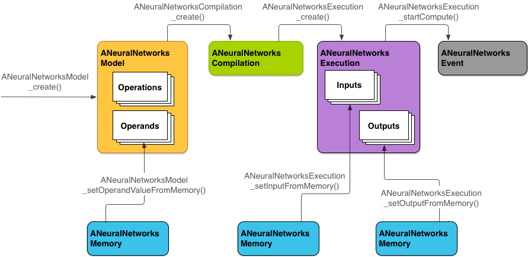
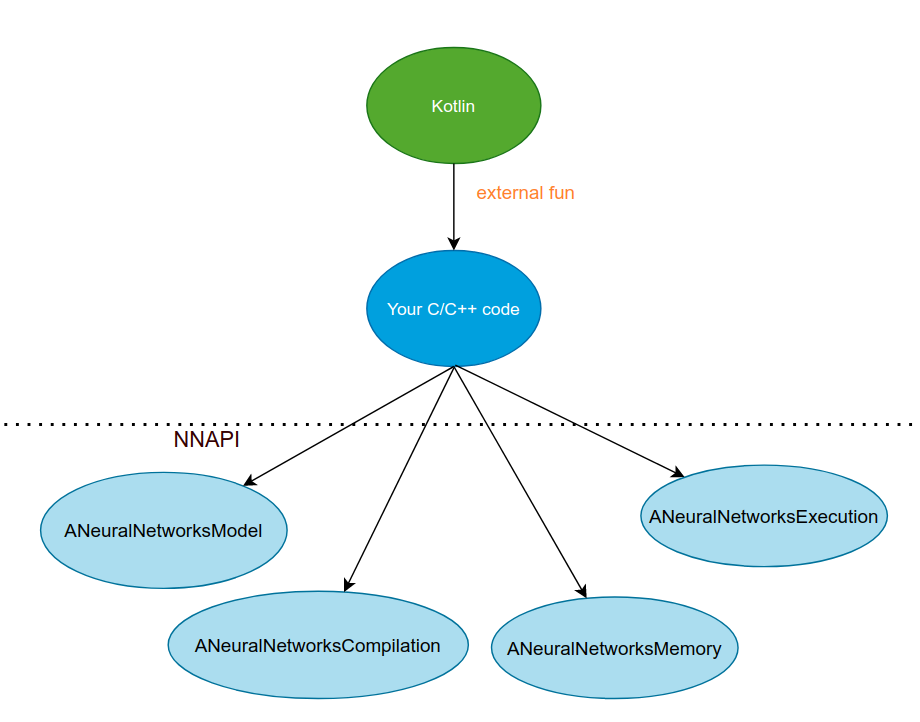
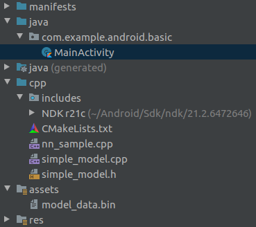
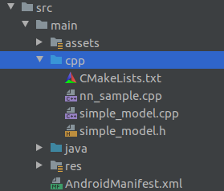

# Neural Networks API

## Общие сведения

Neural Networks API (NNAPI) - апи для работы с нейронными сетями на Android на языке C.

Доступен для SDK Api 27+ (Android 8.1)

Среди основных задач:

* Класификация изображений
* Прогнозирование поведения юзера
* Выбор подходящий ответов для поискового запроса

NNAPI использует модели нейросетей, хранящиеся на устройстве, что дает свои приемущества и недостатки

## Преимущества

1.  Меньше задержек
>Не нужно отправлять данные на сервер (критично для работы с видео, или обработки в риалтайм )

2. Доступность/стабильность
>приложение сможет работать когда нет хорошего соединения с сетью

3. Скорость
>У некоторых девайсов есть специальное hardware для быстрого выполнения операций, которые используются в машинном обучении

4. Конфиденциальность
>Т.к обработка данных производится на устройстве, то у юзера не похитят эти данные при общении с сервером, и не украдут с сервера

5. Стоимость
 >Компания экономит на серверах,

 >Клиент - на плате за интернет

## Недостатки

 1. Батарея
 > Такие вычисления требуют много энергии

 > Активное использование сети тоже нагружало бы батарею

 0. Память
 > Модели могут занимать дополнительные мегабайты. Что бы уменьшить вес приложения в маркете, можно:

 > 1) устанавливать модели после установки приложения

 > 2) упростить модель

## Предназначение

NNAPI предназначен в первую очередь для библиотек, фреймворков и инструментов для ML, а не для прямого использования приложениями

Код, работающий поверх NNAPI, сможет эффективно распределять вычислителдьную нагрузку между :
 * специальным hardware для нейросетей
 * GPU
 * DSP
 * CPU

 

NNAPI проверяет наличие драйверов производителя для разного оборудования, и в случае их отсутствия выполнит работу на CPU

## Структура

NNAPI состоит из таких абстракций:

### Model

  **ANeuralNetworksModel**

 >Направленный граф (нейросеть)

 >Ее создание - синхронная операция. После создания ее можно использовать в разных потоках и

### Compilation

**ANeuralNetworksCompilation**

 >Конфигурация для компиляции модели в низкоуровневый код.

 >Ее создание - синхронная операция

### Memory

**ANeuralNetworksMemory**

 > Общая память, memory-mapped files, и другие буферы

 > Использование такого буфера позволяет более эффективно использовать память при передаче данных драйверам

 > Обычно приложение обходится 1 буфером. хранящим все тензоры. Можно также использовать для хранения входных и выходных данных

### Execution

 **ANeuralNetworksExecution**

 > Интерфейс для применения модели к входным данным.

 > Может использоваться ассинхронно

 

 # Использование

 ## Обобщенная структура
  

 ## Пример

   in project:   

 Отличается:
 *  папкой **cpp**
 *  моделью в **assets**

 ### CPP

 * NDK - набор инструментов для использования C/C++ кода в Android
 * CMakeList.txt - генерирует файлы, необходимые для сборки C/C++ кода
 * nn_sample.cpp  - реализация **external**(native) функций, вызываемых из Kotlin (Java)
 * simple_model.h - Файл заголовка класса, работающего с NNAPI
 * simple_model.cpp -Реализация методов класса

 Работа с классами NNAPI (**ANeuralNetworksModel**,**ANeuralNetworksCompilation**, **ANeuralNetworksMemory**, **ANeuralNetworksExecution**) описана в классе модели

 ### Model

 Обученная нейросеть, лежащая в assets. На ее основе создается ANeuralNetworksMemory
